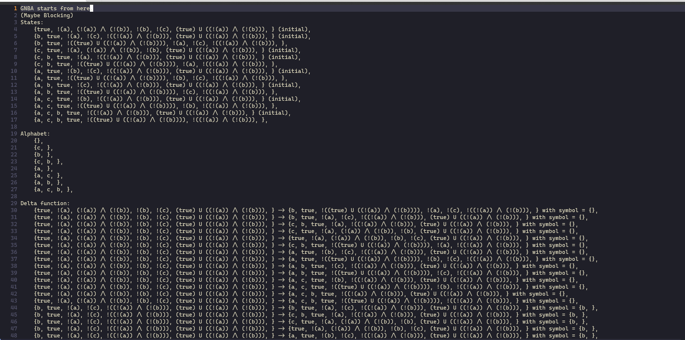

# the-unconsoled
CS3959 homework in ACM 2019 class, a model checking algorithm for LTL formula
## Input and output
The program loads transition system from `TS.txt` and LTL formula from `benchmark.txt`. The debug info is written to `log.txt`.

## Implement
### LTL Parser
This project uses [Antlr4](https://github.com/antlr/antlr4) as a third-party parser. A visitor is implemented to build a abstract syntax tree of the formula.

`LTL::LTL_Base` is the base class of the abstract syntax tree, from which `LTL::Negation`, `LTL::Next`, `'LTL::Until`, `LTL::And` and `LTL::Variable` are derived.

The closure of an LTL formula is easy to compute by simply traversing the abstract syntax tree, which is implemented as `get_closure`.

### From LTL formula to generalized nondeterministic Buchi automaton
The GNBA is constructed following the proof of Theorem 5.37 (page 278 of *Principles of Model Checking*), which is implemented as a construction function of class `GNBA`.

In order to track the subsets of a fixed set, a helper template class `PowerSet` is implemented in `Tools.hpp`.

With `PowerSet`, all subsets of $closure(\varphi)$ is examined and a brute-force check is performed to determine whether the subset is elementary.

The remaining part is direct to code.

### From generalized nondeterministic Buchi automaton to nondeterministic Buchi automaton
The NBA is constructed following the proof of Theorem 4.56 (page 195 of *Principles of Model Checking*), which is implemented as a construction function of class `NBA`.

### Cross product of transition system and nondeterministic Buchi automaton
The cross product of transition system and NBA is implemented in `TransitionSystem::product`, which basically follows Definition 4.62 (page 200 of *Principles of Model Checking*).

### Persistence checking
The persistence checking is implemented in `TransitionSystem::persistence_checking`, which basically follows the nested depth-first search (page 211 of *Principles of Model Checking*).

The $F$ propositions is recorded as parameter `F`.